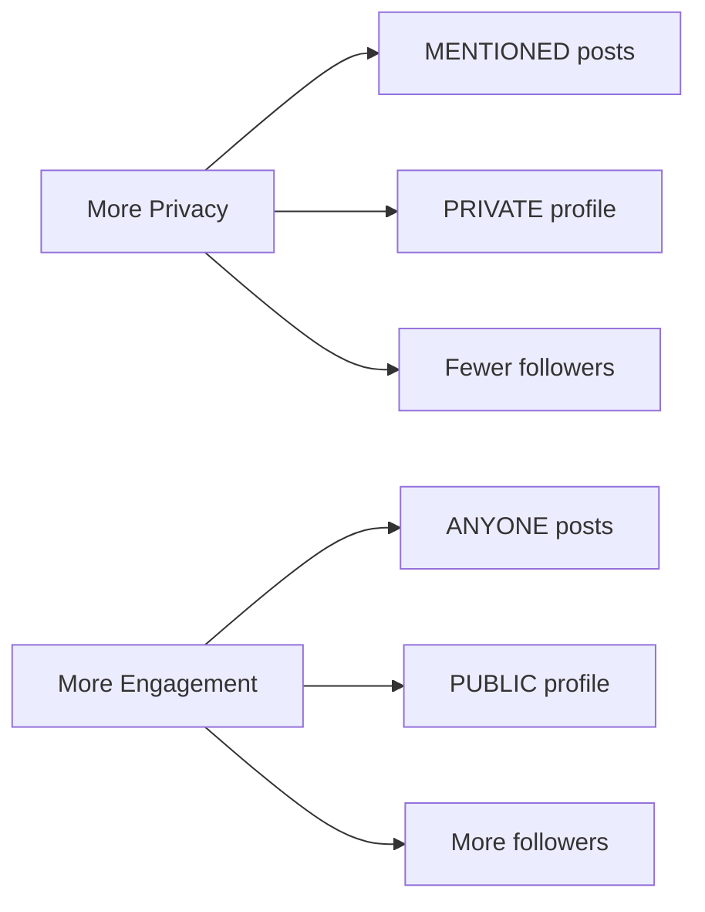

## Overview

Privacy is at the core of Echo. You have complete control over who can see your profile, posts, and activity. Your real identity is never exposed - only your chosen username is visible to other users.

## Profile privacy

Control who can see your profile and follow you.

<Tabs>
  <Tab title="Public profile">
    ```prisma
    privacy: Privacy.PUBLIC
    ```

    **Anyone in your college can:**
    - View your profile
    - See your posts
    - Follow you without approval
    - View your follower/following lists

    <Info>
      This is the default setting for new accounts.
    </Info>
  </Tab>

  <Tab title="Private profile">
    ```prisma
    privacy: Privacy.PRIVATE
    ```

    **Restricted access:**
    - Only approved followers see your posts
    - Profile is visible but posts are hidden
    - Follower/following lists are hidden
    - Follow requests require approval (if implemented)

    <Tip>
      Use private profiles when you want more control over your audience.
    </Tip>
  </Tab>
</Tabs>

### Change profile privacy

<Steps>
  <Step title="Navigate to settings">
    Go to your profile and click **Edit Profile** or **Settings**.
  </Step>

  <Step title="Toggle privacy">
    Select your preferred privacy level:

    ```typescript
    // Update user privacy
    await fetch('/api/profile/edit', {
      method: 'PATCH',
      headers: { 'Content-Type': 'application/json' },
      body: JSON.stringify({
        privacy: 'PRIVATE' // or 'PUBLIC'
      })
    });
    ```
  </Step>

  <Step title="Save changes">
    Your privacy setting is updated immediately and affects all future interactions.
  </Step>
</Steps>

### Privacy schema

```prisma schema.prisma
model User {
  id        String   @id @default(cuid())
  username  String   @unique
  privacy   Privacy  @default(PUBLIC)
  // ... other fields
}

enum Privacy {
  PUBLIC   // Open profile
  PRIVATE  // Restricted profile
}
```

## Post privacy

Each post can have its own privacy level, independent of your profile privacy.

<Tabs>
  <Tab title="Anyone">
    ```typescript
    privacy: "ANYONE"
    ```

    **Visibility:**
    - All users in your college can see this post
    - Appears in public feeds and search results
    - Anyone can like, reply, and repost

    **Best for:**
    - General announcements
    - Public discussions
    - Community engagement
  </Tab>

  <Tab title="Followers only">
    ```typescript
    privacy: "FOLLOWED"
    ```

    **Visibility:**
    - Only users who follow you can see this post
    - Hidden from public feeds
    - Only followers can interact

    **Best for:**
    - Personal updates
    - Semi-private thoughts
    - Follower-exclusive content
  </Tab>

  <Tab title="Mentioned only">
    ```typescript
    privacy: "MENTIONED"
    ```

    **Visibility:**
    - Only users you mention with `@username` can see this
    - Completely hidden from feeds
    - Only mentioned users can interact

    **Best for:**
    - Direct messages (as posts)
    - Private conversations
    - Specific call-outs

    <Warning>
      If you don't mention anyone, only you will see the post.
    </Warning>
  </Tab>
</Tabs>

### Set post privacy

<CodeGroup>
```typescript Create Post with Privacy
const createPost = async (content: string, privacy: PostPrivacy) => {
  const response = await fetch('/api/post', {
    method: 'POST',
    headers: { 'Content-Type': 'application/json' },
    body: JSON.stringify({
      content,
      privacy, // "ANYONE" | "FOLLOWED" | "MENTIONED"
      media: []
    })
  });

  return response.json();
};
```

```typescript Type Definition
type PostPrivacy = 
  | "ANYONE"      // Public to all college users
  | "FOLLOWED"   // Only followers
  | "MENTIONED"; // Only mentioned users

interface CreatePostRequest {
  content: string;
  privacy: PostPrivacy;
  media?: string[];
  parentPostId?: string;
  quoteId?: string;
}
```
</CodeGroup>

## Anonymous identity protection

Echo uses multiple layers to protect your real identity:

<Accordion title="Cryptographic hashing">
  Your credentials never link directly to your account:

  ```typescript
  import { createHash } from 'crypto';

  export function generateUserHash(
    email: string, 
    password: string
  ): string {
    const salt = process.env.AUTH_SALT;
    const combined = `${email}:${password}:${salt}`;
    return createHash('sha256').update(combined).digest('hex');
  }
  ```

  **What this means:**
  - Your email is never stored in the database
  - Your password is never stored in plain text
  - Your `userHash` can't be reversed to reveal credentials
  - Only you can authenticate with your email/password combo

  <Warning>
    Never share your email or password. Echo staff cannot recover your account if you lose these credentials.
  </Warning>
</Accordion>

<Accordion title="Username-only visibility">
  Other users only see:

  ```typescript
  // Visible user information
  {
    username: "johndoe",
    college: {
      name: "University Name"
    },
    bio: "Optional bio text",
    privacy: "PUBLIC" | "PRIVATE"
  }
  ```

  **Hidden from all users:**
  - Real name
  - Email address
  - User hash
  - IP address
  - Device information
  - Authentication credentials
</Accordion>

<Accordion title="College isolation">
  Users can only interact within their college:

  ```typescript
  // Users are filtered by college
  const posts = await db.post.findMany({
    where: {
      author: {
        collegeId: currentUser.collegeId
      }
    }
  });
  ```

  **Benefits:**
  - Your activity stays within your college community
  - No cross-college data leakage
  - Isolated social graphs
</Accordion>

## Data you control

You have full control over these visible attributes:

<CardGroup cols={2}>
  <Card title="Username" icon="user">
    Your public identifier. Choose wisely - it's how others recognize you.
  </Card>
  <Card title="Bio" icon="align-left">
    Optional description. Share as much or as little as you want.
  </Card>
  <Card title="Profile privacy" icon="lock">
    Public or private - control who sees your content.
  </Card>
  <Card title="Post privacy" icon="shield">
    Per-post privacy levels for granular control.
  </Card>
</CardGroup>

## Privacy best practices

<Steps>
  <Step title="Choose a non-identifying username">
    Avoid usernames that reveal:
    - Your real name
    - Student ID numbers
    - Birthdate or personal information
    - Department or major (if you want privacy)

    <Tip>
      Good: `coffee_lover`, `anonymous_poet`, `night_owl`
      
      Avoid: `john.doe.2024`, `cs.student.500123`
    </Tip>
  </Step>

  <Step title="Be mindful in your bio">
    Don't include:
    - Phone numbers
    - External social media handles
    - Personal email addresses
    - Location details beyond college
  </Step>

  <Step title="Use appropriate post privacy">
    Match privacy to content sensitivity:

    | Content Type | Recommended Privacy |
    |--------------|--------------------|
    | Public opinion | ANYONE |
    | Personal update | FOLLOWED |
    | Direct message | MENTIONED |
    | Sensitive topic | FOLLOWED or MENTIONED |
  </Step>

  <Step title="Review your posts regularly">
    Periodically check your post history and delete anything you no longer want public.
  </Step>

  <Step title="Be careful with media">
    Images can reveal:
    - Location (EXIF data - stripped by Echo)
    - Time and date
    - People in photos
    - Identifiable objects

    <Warning>
      Even with EXIF data removed, be mindful of what's visible in photos.
    </Warning>
  </Step>
</Steps>

## What Echo stores

Transparency about data storage:

<Tabs>
  <Tab title="Stored data">
    ```typescript
    // Database fields for User
    {
      id: "cuid",              // Random identifier
      userHash: "sha256_hash", // Credential hash
      username: "chosen_name",
      bio: "optional_bio",
      privacy: "PUBLIC" | "PRIVATE",
      collegeId: "college_id",
      createdAt: "timestamp",
      updatedAt: "timestamp",
      isAdmin: false
    }
    ```

    <Info>
      No email, password, or personally identifiable information is stored.
    </Info>
  </Tab>

  <Tab title="Not stored">
    Echo **never** stores:

    - Your email address (only the hash)
    - Your password (only used to generate hash)
    - Your real name
    - IP addresses (beyond rate limiting)
    - Device fingerprints
    - Tracking cookies
    - Browser history
    - Location data
  </Tab>

  <Tab title="Temporary data">
    Short-lived data:

    - **Rate limit counters**: Stored in Redis, expire after 1 minute
    - **Email verification codes**: Expire after use or timeout
    - **Session tokens**: JWT, expire after 30 days

    ```typescript
    // Rate limit data (Redis)
    {
      key: `ratelimit:${userId}`,
      value: count,
      expiration: 60 // seconds
    }
    ```
  </Tab>
</Tabs>

## Privacy for different use cases

<AccordionGroup>
  <Accordion title="Maximum anonymity">
    For complete anonymity:

    1. Use a non-identifying username
    2. Leave bio empty
    3. Set profile to PRIVATE
    4. Use FOLLOWED or MENTIONED for all posts
    5. Don't upload identifiable photos
    6. Avoid mentioning specific details (schedule, location, etc.)
  </Accordion>

  <Accordion title="Public engagement">
    For active community participation:

    1. PUBLIC profile
    2. ANYONE for most posts
    3. Thoughtful bio to attract followers
    4. Engage with likes and replies
    5. Curate content through reposts
  </Accordion>

  <Accordion title="Selective sharing">
    For controlled visibility:

    1. PUBLIC profile
    2. Mix of ANYONE and FOLLOWED posts
    3. Use MENTIONED for private conversations
    4. Approve followers carefully (if feature exists)
    5. Regular post audits
  </Accordion>
</AccordionGroup>

## Privacy vs. engagement trade-off

Understand the balance:



<Note>
  You can adjust privacy settings anytime. Experiment to find what works for you.
</Note>

## Reporting privacy violations

If someone violates privacy norms:

<Steps>
  <Step title="Document the violation">
    Take note of:
    - The username
    - The specific post or behavior
    - Why it violates privacy
  </Step>

  <Step title="Report the content">
    ```typescript
    // Report a post
    await fetch('/api/profile/report', {
      method: 'POST',
      body: JSON.stringify({
        postId: "violating_post_id",
        reason: "Reveals personal information of other users"
      })
    });
    ```
  </Step>

  <Step title="Block the user (if feature exists)">
    Prevent further interactions with the violating user.
  </Step>
</Steps>

## Next steps

<CardGroup cols={2}>
  <Card title="Content moderation" icon="shield-check" href="/security/content-moderation">
    Learn about reporting and safety features
  </Card>
  <Card title="Authentication" icon="key" href="/authentication">
    Understand how your credentials are protected
  </Card>
  <Card title="Posts" icon="pencil" href="/features/posts">
    Master post privacy settings
  </Card>
  <Card title="Social features" icon="heart" href="/features/social">
    See how privacy affects social interactions
  </Card>
</CardGroup>